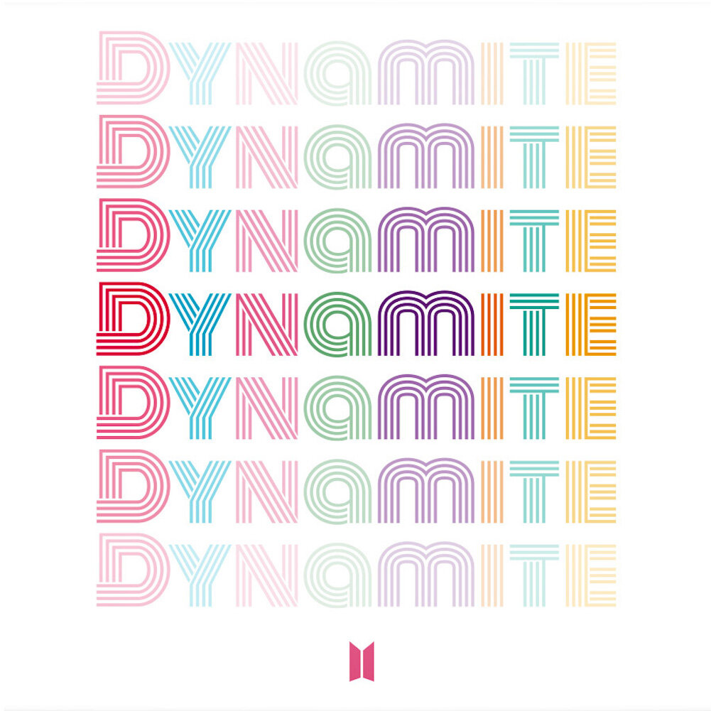

# Music-player1
This is the website which made by me and totaly new. I motivated by ganna.com music website and try to implement similar like this and added some new features in my website. This website responsible to all size of device and it's challenges for me and I gave lots of time on it and learnt many things for it.
The Hosted link of this website: https://kanhaiya8521.github.io/Music-player1/index.html
What I feature added in it I commented in every line of code in my website source file and source files has opened for all of you so go on them and explore if u have any suggestion for me please give me that 's why I will in future as well.

University Institute of Engineering and Technology, Panjab University Hoshiarpur

                                            
	
Mid Term Industrial Training

                                                               ________________________________

                                                                     CREATORS

Name: Kanhaiya Kumar
IT - (SG19820)

TABLE OF CONTENTS:
1) Introduction
2) Purpose
3) Target Audience
4) Scope
5) Project Objectives
5.1) Goals
5.2) Tasks
5.2.1) Proper Environment Setup
5.2.2) Frame Work Building
5.2.3) Designing
5.2.4) Coding
5.2.5) Testing
5.2.6) Bug Fixing
5.2.7) Final Documentation
5.3) Resources
5.4) Budget
6) Milestone
7) Abbrevations
8) Project Client
9) Project Manager
10) Project Group
11) Steering Group
12) Requirements
13) Requirement Summary
14) Project Specifications
15) Pages
16) Project Experience

1.	INTRODUCTION:-

The Web Music Player is a music platform designed to play music from across the web by utilizing a simple chrome browser. The intent is to designate a machine to present a simple frontend web page of music playe website and play music for other devices to control through a Web Interface.

2.	PURPOSE:-

They are portable digital music players that play music as audio files, such as MP3. In addition, most of these devices allow to store video, pictures, and to receive radio and TV programs (podcasting). Earphones and external speakers are the typical output devices delivering sound to the listener.

3.	SCOPE:-

The music player allows a user to play various media file formats. It can be used to play audio as well as video files. The music player is a software project supporting all known media files and has the ability to play them with ease.

4. GOALS:-
The primary purpose of the music streaming application is to play music available in the databases of the service, compose custom playlists and suggest similar songs. The main elements of music streaming apps are: Discovery.

5. RESOURCES:-
They are portable digital music players that play music as audio files, such as MP3. In addition, most of these devices allow to store video, pictures, and to receive radio and TV programs (podcasting). Earphones and external speakers are the typical output devices delivering sound to the listener.

6. MILESTONE:-

			
Description 	Fixed date
Kick off	Project start date – 05 july 2022
Design	Design and layout must be completed till 25 july 2022
Basic structure	Basic structure of the website must be completed till 25 july 2022
Functionalities	All the functionalities must be completed till 25july 2022
Testing	Testing should be done till 30july 2022
Bug fixing	Till 30july 2022
Finishing	                                                       	Design finishing should be done till 30july 2022

7. STEERING GROUP:-
Kanhaiya Kumar	HEAD

13. REQUIREMENT:-
API	No
Environment setup
(1)VS - code & (2)bracket	Yes
Bootstrap framework	Yes
JQuery plugin 	No
Basic
(1)HTML(2)CSS(3)JS	Yes
Photoshop	Yes
Illustrator	Yes
Internet	Yes
TeamViewer	Yes
NPM	No
Preloaded	No
Nodejs	No
GitHub	Yes
Server	No

14. Project experience:-
(i) Positive and excellent experience during doing this project.
(ii) Time management and get to know how to tackle problem.
(iii) Group coordination improvement.
(iv) Improved mistakes.
(v) Learned about these technologies more while working on them in the project.

 
 
 
Code:
<!DOCTYPE html>
<html lang="en">
<head>
    <meta charset="utf-8">
    <meta name="viewport" content="width=device-width, initial-scale=1">
    <title>Home Page</title>
    <link rel="stylesheet" type="text/css" href="index.css">
    <link rel="stylesheet" type="text/css" href="index_responsive.css">
    
</head>
<body>
    <!-- top navigation bar -->
    <nav class="navigation-bar">
        <!-- this div contains the logo and title os the page -->
        

            

                
            

            

                <h2>
                    <a href="index2.html">
                        Kanhaiya
                    </a>
                </h2>
                <h6 style="color: magenta;">
                    <a href="index2.html">Music Player</a>
                </h6>
            

        

        <!-- this is the animated favourites text -->
        

            <h4>
                <a href="index2.html">Favourites</a>
                
            </h4>
        

        

            

                <!-- magnifying glass- search icon -->
                <i class="fas fa-search search-ico"></i>
            

            <input type="text" name="search" placeholder="Search">
            

                <!-- mic icon -->
                <i class="fas fa-microphone mic-ico"></i>
            

        

        <!-- this is for notification bell -->
        

            <a href="index2.html">
             Notifications
            </a>
        

        <!-- this is for profile picture -->
        

            
        

    </nav>
    <!-- this is the main center part of the page and it is divided into two sections, namely section 1 and section 2-->
    <!-- I have separated these sections using the aside tag for each section -->
    <main>
        <!-- aside section 1 -->
        <aside class="aside section-1">
            <!-- this is for the jumbotron -->
            

                

                    <!-- there is nothing in this div because all the images and all are added by css -->
                

                <!-- jumbotron details -->
                

                    <!-- descriptive part of the jumbotron this will contain name , number of followers and all -->
                    

                        

                            <h1>ColdPlay</h1>
                        

                        

                            21m Followers
                        

                        
British Band

                        <!-- short description of the current author -->
                        

                            Coldplay are a British rock band formed in London in 1996. Vocalist, rhythm guitarist and pianist Chris Martin, lead guitarist Jonny Buckland, bassist Guy Berryman, and drummer Will Champion met at University College London and began playing music together from 1996 to 1998, first calling themselves Pectoralz and then Starfish before finally changing their name to Coldplay
                        

                    

                    <!-- action part -->
                    

                        <!-- action buttons -->
                        

                            
                            <button>Play All</button>
                            <button>Follow</button>
                        

                        

                            247 Tracks | 128 Albums
                        

                    

                

            

            <!-- now the playlist part begins -->
            

                <!-- playlist item -->
                

                    

                        

                            01
                        

                        

                            
                            

                                <i class="fas fa-play"></i>
                            

                        

                        

                            <h5>
                                Alone
                            </h5>
                            

                                Alan Walker
                            

                        

                    

                    

                        3:14
                    

                    

                        

                            <i class="far fa-heart"></i>
                        

                        

                            <i class="fas fa-plus"></i>
                        

                    

                

                <!-- playlist item -->
                

                    

                        

                            02
                        

                        

                            
                            

                                <i class="fas fa-play"></i>
                            

                        

                        

                            <h5>
                                White Iverson
                            </h5>
                            

                                Post Malone
                            

                        

                    

                    

                        3:44
                    

                    

                        

                            <i class="far fa-heart"></i>
                        

                        

                            <i class="fas fa-plus"></i>
                        

                    

                

                <!-- playlist item -->
                

                    

                        

                            03
                        

                        

                            
                            

                                <i class="fas fa-play"></i>
                            

                        

                        

                            <h5>
                                Go Flex
                            </h5>
                            

                                Post Malone
                            

                        

                    

                    

                        2:55
                    

                    

                        

                            <i class="far fa-heart"></i>
                        

                        

                            <i class="fas fa-plus"></i>
                        

                    

                

                <!-- playlist item -->
                

                    

                        

                            04
                        

                        

                            
                            

                                <i class="fas fa-play"></i>
                            

                        

                        

                            <h5>
                                Better Now
                            </h5>
                            

                                Post Malone
                            

                        

                    

                    

                        3:37
                    

                    

                        

                            <i class="far fa-heart"></i>
                        

                        

                            <i class="fas fa-plus"></i>
                        

                    

                

                <!-- playlist item -->
                

                    

                        

                            05
                        

                        

                            
                            

                                <i class="fas fa-play"></i>
                            

                        

                        

                            <h5>
                                Big lie
                            </h5>
                            

                                Post Malone
                            

                        

                    

                    

                        3:27
                    

                    

                        

                            <i class="far fa-heart"></i>
                        

                        

                            <i class="fas fa-plus"></i>
                        

                    

                

                <!-- playlist item -->
                

                    

                        

                            06
                        

                        

                            
                            

                                <i class="fas fa-play"></i>
                            

                        

                        

                            <h5>
                                Deja Vu
                            </h5>
                            

                                Post Malone & Justin Beiber
                            

                        

                    

                    

                        4:31
                    

                    

                        

                            <i class="far fa-heart"></i>
                        

                        

                            <i class="fas fa-plus"></i>
                        

                    

                

                <!-- playlist item -->
                

                    

                        

                            07
                        

                        

                            
                            

                                <i class="fas fa-play"></i>
                            

                        

                        

                            <h5>
                                Pysco
                            </h5>
                            

                                Post Malone 
                            

                        

                    

                    

                        3:28
                    

                    

                        

                            <i class="far fa-heart"></i>
                        

                        

                            <i class="fas fa-plus"></i>
                        

                    

                

                <!-- playlist item -->
                

                    

                        

                            08
                        

                        

                            
                            

                                <i class="fas fa-play"></i>
                            

                        

                        

                            <h5>
                                Rockstar
                            </h5>
                            

                                Post Malone & 21 Savage
                            

                        

                    

                    

                        3:48
                    

                    

                        

                            <i class="far fa-heart"></i>
                        

                        

                            <i class="fas fa-plus"></i>
                        

                    

                

                <!-- playlist item -->
                

                    

                        

                            09
                        

                        

                            
                            

                                <i class="fas fa-play"></i>
                            

                        

                        

                            <h5>
                                Blinding Lights
                            </h5>
                            

                                Weeknd
                            

                        

                    

                    

                        3:20
                    

                    

                        

                            <i class="far fa-heart"></i>
                        

                        

                            <i class="fas fa-plus"></i>
                        

                    

                

                <!-- playlist item -->
                

                    

                        

                            10
                        

                        

                            
                            

                                <i class="fas fa-play"></i>
                            

                        

                        

                            <h5>
                                Alone Again
                            </h5>
                            

                                Weeknd
                            

                        

                    

                    

                        4:10
                    

                    

                        

                            <i class="far fa-heart"></i>
                        

                        

                            <i class="fas fa-plus"></i>
                        

                    

                

                <!-- playlist item -->
                

                    

                        

                            11
                        

                        

                            
                            

                                <i class="fas fa-play"></i>
                            

                        

                        

                            <h5>
                                Too Late
                            </h5>
                            

                                Weeknd
                            

                        

                    

                    

                        4:00
                    

                    

                        

                            <i class="far fa-heart"></i>
                        

                        

                            <i class="fas fa-plus"></i>
                        

                    

                

                <!-- playlist item -->
                

                    

                        

                            12
                        

                        

                            
                            

                                <i class="fas fa-play"></i>
                            

                        

                        

                            <h5>
                                Hardest To Love
                            </h5>
                            

                                Weeknd
                            

                        

                    

                    

                        3:31
                    

                    

                        

                            <i class="far fa-heart"></i>
                        

                        

                            <i class="fas fa-plus"></i>
                        

                    

                

            

        </aside>
        <!-- one aside section is complete -->
        <!-- now the second aside section will start from here -->
        <!-- the page is responsive. please try reducing the width of the page -->
        <!-- the aside section will collapse and a "more button will be shown to you." -->
        <!-- clicking on this more button, you will be shown the aside section 2  -->
        <!-- its position will be absolute at lower resolutions -->
        <!-- this is the label for that more button -->
        <label for="more"><i class="fas fa-angle-double-left"></i>More</label>
        <!-- this is that more button -->
        <!-- and this is the check box. this will always be hidden -->
        <!-- check the stylesheet_main.css when the label is clicked, this checkbox will be checked -->
        <!-- which will invoke the aside section 2 on lower resolutions -->
        <input type="checkbox" id="more">
        <!-- 
 -->
        <aside class="aside section-2">
            <!-- similar class will be applicable to both similar artists and recently played -->
            

                <!-- section heading, which also contains the view all button -->
                

                    <h1>Similar Artists</h1>
                    

                        View All
                    

                

                <!-- list is the container for the contents of similar artists -->
                

                    <!-- item -->
                    

                        

                            
                            

                                <i class="fas fa-play"></i>
                            

                        

                        

                            <h5>
                                Love me
                            </h5>
                            

                                Justin Beiber
                            

                        

                        

                            

                                <i class="fas fa-ellipsis-h"></i>
                            

                            

                                2:14
                            

                        

                    

                    <!-- item -->
                    

                        

                            
                            

                                <i class="fas fa-play"></i>
                            

                        

                        

                            <h5>
                                Gotti
                            </h5>
                            

                                6ix9ine
                            

                        

                        

                            

                                <i class="fas fa-ellipsis-h"></i>
                            

                            

                                4:00
                            

                        

                    

                    <!-- item -->
                    

                        

                            
                            

                                <i class="fas fa-play"></i>
                            

                        

                        

                            <h5>
                                WAP
                            </h5>
                            

                                Cardi B
                            

                        

                        

                            

                                <i class="fas fa-ellipsis-h"></i>
                            

                            

                                4:44
                            

                        

                    

                

                <!-- recently played section -->
                

                    <!-- section headings, which also contains the view all button -->
                    

                        <h1>Recently Played</h1>
                        

                            View All
                        

                    

                    <!-- again list is a container for all the contents of recently played section -->
                    

                        <!-- item -->
                        

                            

                                

                                    01
                                

                                

                                    
                                    

                                        <i class="fas fa-play"></i>
                                    

                                

                                

                                    <h5>
                                        I'll wait
                                    </h5>
                                    

                                        Kygo
                                    

                                

                            

                            

                                

                                    <i class="far fa-heart"></i>
                                

                            

                        

                        <!-- item -->
                        

                            

                                

                                    02
                                

                                

                                    
                                    

                                        <i class="fas fa-play"></i>
                                    

                                

                                

                                    <h5>
                                        Let Me Go
                                    </h5>
                                    

                                        NoMethod
                                    

                                

                            

                            

                                

                                    <i class="far fa-heart"></i>
                                

                            

                        

                        <!-- item -->
                        

                            

                                

                                    03
                                

                                

                                    
                                    

                                        <i class="fas fa-play"></i>
                                    

                                

                                

                                    <h5>
                                        ILY
                                    </h5>
                                    

                                        Surf Mesa
                                    

                                

                            

                            

                                

                                    <i class="far fa-heart"></i>
                                

                            

                        

                        <!-- item -->
                        

                            

                                

                                    04
                                

                                

                                    
                                    

                                        <i class="fas fa-play"></i>
                                    

                                

                                

                                    <h5>
                                        Roar
                                    </h5>
                                    

                                        Ketty Perry
                                    

                                

                            

                            

                                

                                    <i class="far fa-heart"></i>
                                

                            

                        

                        <!-- item -->
                        

                            

                                

                                    05
                                

                                

                                    
                                    

                                        <i class="fas fa-play"></i>
                                    

                                

                                

                                    <h5>
                                        Toosie Slide
                                    </h5>
                                    

                                        Drake
                                    

                                

                            

                            

                                

                                    <i class="far fa-heart"></i>
                                

                            

                        

                        <!-- item -->
                        

                            

                                

                                    06
                                

                                

                                    
                                    

                                        <i class="fas fa-play"></i>
                                    

                                

                                

                                    <h5>
                                        Uptwon Funk
                                    </h5>
                                    

                                        Bruno
                                    

                                

                            

                            

                                

                                    <i class="far fa-heart"></i>
                                

                            

                        

                        <!-- item -->
                        

                            

                                

                                    07
                                

                                

                                    
                                    

                                        <i class="fas fa-play"></i>
                                    

                                

                                

                                    <h5>
                                        Baarish
                                    </h5>
                                    

                                        Half Girlfriend
                                    

                                

                            

                            

                                

                                    <i class="far fa-heart"></i>
                                

                            

                        

                        <!-- item -->
                        

                            

                                

                                    08
                                

                                

                                    
                                    

                                        <i class="fas fa-play"></i>
                                    

                                

                                

                                    <h5>
                                        Gulliyon
                                    </h5>
                                    

                                        Ek Villan
                                    

                                

                            

                            

                                

                                    <i class="far fa-heart"></i>
                                

                            

                        

                        <!-- item -->
                        

                            

                                

                                    09
                                

                                

                                    
                                    

                                        <i class="fas fa-play"></i>
                                    

                                

                                

                                    <h5>
                                        All-is-well
                                    </h5>
                                    

                                        3idiots
                                    

                                

                            

                            

                                

                                    <i class="far fa-heart"></i>
                                

                            

                        

                    

                

            

        </aside>
    </main>

    <!-- main part of the page is over. -->
    <!-- this is the footer part. -->
    <!-- its position will be fixed to the screen bottom. -->
    <footer>
        

            <!-- song image -->
            

                
            

            <!-- song name and author -->
            

                

                    White Iverson
                

                

                    Post Malone
                

            

                <!-- heart icon and ban icon -->
            

                
                    <i class="far fa-heart"></i>
                
                
                    <i class="fas fa-ban"></i>
                
            

        

        <!-- these are the main player controls -->
        

            

                
<i class="fas fa-random"></i>

                
<i class="fas fa-step-backward"></i>

                
<i class="fas fa-pause-circle"></i>

                
<i class="fas fa-step-forward"></i>

                
<i class="fas fa-redo"></i>

            

            <!-- this is the slider -->
            

                <!-- current time -->
                

                    1:39
                

                

                    <input type="range" min="0" max="100" value="0" class="slider" id="myRange">
                

                <!-- total time -->
                

                    4:44
                

            

        

        <!-- other icons including the volume slider and all -->
        

            

                <i class="fas fa-list-ul"></i>
            

            

                <i class="fas fa-laptop"></i>
            

            

                <i class="fas fa-volume-up"></i>
            

            

                <input type="range" min="0" max="100" value="0" class="slider" id="myRange" style="margin-top:0px;">
            

            

                <i class="fas fa-expand-alt"></i>
            

        

    </footer>
</body>
</html>

 
 
 
<!-- Codes -->
<!DOCTYPE html>
<html lang="en">

<head>
    <meta charset="UTF-8">
    <meta name="viewport" content="width=device-width, initial-scale=1.0">
    <title>Kanhaiya Music Player</title>
    <!-- it is connected to two stylesheets -->
    <link rel="stylesheet" type="text/css" href="index2.css"><!-- this is the main stylesheet -->
    <!-- desktop first approach is used for the same. -->
    <link rel="stylesheet" type="text/css" href="index2_responsive.css"><!-- this is the style sheet with all the media queries -->
    <!-- this script is just for font awesome fonts -->
    
</head>
<!-- body -->

<body>
    <!-- top navigation bar -->
    <nav class="navigation-bar">
        <!--This div contains the logo and title of the page-->
        

            

                
            

            

                 <h2>
                    <a href="index.html">
                        Kanhaiya
                    </a>
                </h2>
                 <h6 style="color: magenta;">
                    <a href="index.html">Music Player</a>
                </h6>
            

        

        <!-- this is the animated favourites text -->
        

            <h4>
                <a href="index.html">
                    Favourites
                </a>
                
            </h4>
        

        <!-- this is for search bar -->
        

            

                <!-- magnifying glass- search icon -->
                <i class="fas fa-search search-ico"></i>
            

            <input type="text" name="search" placeholder="Search">
            

                <!-- mic icon -->
                <i class="fas fa-microphone mic-ico"></i>
            

        

        <!-- this is for notification bell -->
        

             Notifications

        

        <!-- this is for profile picture -->
        

            
            
        

    </nav>
    <!-- this is the main center part of the page and it is divided into two sections, namely section 1 and section 2-->
    <!-- I have separated these sections using the aside tag for each section -->
    <main>
        <!-- aside section 1 -->
        <aside class="aside section-1">
            <!-- this is for the carousel -->
            

                

                    <!-- these are the 3 images in the carousel -->
                    
                    
                    
                

            

            <!-- this is the latest release section -->
            

                <h1 style="margin-bottom: 12px;">
                    Latest Release
                </h1>
                <!-- this is the content of the latest release section -->
                <!-- it will contain the "cards" -->
                

                    <!-- first card -->
                    

                        

                            <!-- image corresponding to the card -->
                            
                            <!-- play button, which will be shown on hover on the card image -->
                            

                                <i class="fas fa-play" style="width:45%; height:45%; display:inline-block"></i>
                            

                        

                        <!-- it will contain the name and date of release of the song -->
                        

                            <h3>
                                Willow
                            </h3>
                            

                                Dec , 2020
                            

                        

                        <!-- if someone clicks on the three dots, options will be shown to the user for further action -->
                        

                            <label for="latest-release-checkbox"><i class="fas fa-ellipsis-h"></i></label>
                            <input type="checkbox" id="latest-release-checkbox">
                            

                                

                                    <!-- if user clicks on play now button, he/she will be taken to the single playlist page -->
                                    
<i class="fas fa-play-circle"></i> <a href="Single Playlist Screen.html">Play
                                            Now</a>

                                

                                

                                

                                    
<i class="fas fa-list-ul"></i> Add to Queue

                                

                                

                                

                                    
<i class="fas fa-music"></i> Add to playlist

                                

                                

                                

                                    
<i class="fas fa-info-circle"></i> Get Info

                                

                            

                            <!-- duration of the song -->
                            

                                3:35
                            

                        

                    

                    <!-- second card -->
                    

                        

                            
                            

                                <i class="fas fa-play" style="width:45%; height:45%; display:inline-block"></i>
                            

                        

                        

                            <h3>
                               Blinding Lights
                            </h3>
                            

                                Dec, 2020
                            

                        

                        

                            <label for="latest-release-checkbox2"><i class="fas fa-ellipsis-h"></i></label>
                            <input type="checkbox" id="latest-release-checkbox2">
                            

                                

                                    
<i class="fas fa-play-circle"></i> <a href="Single Playlist Screen.html">Play
                                            Now</a>

                                

                                

                                

                                    
<i class="fas fa-list-ul"></i> Add to Queue

                                

                                

                                

                                    
<i class="fas fa-music"></i> Add to playlist

                                

                                

                                

                                    
<i class="fas fa-info-circle"></i> Get Info

                                

                            

                            

                                3:20
                            

                        

                    

                    <!-- third card -->
                    

                        

                            
                            

                                <i class="fas fa-play" style="width:45%; height:45%; display:inline-block"></i>
                            

                        

                        

                            <h3>
                                ROCKSTAR
                            </h3>
                            

                                Dec, 2020
                            

                        

                        

                            <label for="latest-release-checkbox3"><i class="fas fa-ellipsis-h"></i></label>
                            <input type="checkbox" id="latest-release-checkbox3">
                            

                                

                                    
<i class="fas fa-play-circle"></i> <a href="Single Playlist Screen.html">Play
                                            Now</a>

                                

                                

                                

                                    
<i class="fas fa-list-ul"></i> Add to Queue

                                

                                

                                

                                    
<i class="fas fa-music"></i> Add to playlist

                                

                                

                                

                                    
<i class="fas fa-info-circle"></i> Get Info

                                

                            

                            

                                3:02
                            

                        

                    

                    <!-- fourth card -->
                    

                        

                            
                            

                                <i class="fas fa-play" style="width:45%; height:45%; display:inline-block"></i>
                            

                        

                        

                            <h3>
                                Dynamite
                            </h3>
                            

                                Dec, 2020
                            

                        

                        

                            <!-- NOTE THAT POSITION OF OPTIONS DIV IS RELATIVE -->
                            <label for="latest-release-checkbox4"><i class="fas fa-ellipsis-h"></i></label>
                            <input type="checkbox" id="latest-release-checkbox4">
                            

                                <!-- POSITION OF LATEST RELEASE DROPDOWN IS ABSOLUTE TO THE RELATIVE OPTIONS. THIS IS VERY IMPORTANT AS THE DROPDOWN BOX SHOULD BE PLACED RELATIVE TO THE PARTICULAR ITEM IN THE LATEST RELEASE SECTION. IT SHOULD NOT BE ABSAOLUTE TO THE WHOLE LATEST RELEASE SECTION. THROUGH THIS PROJECT i UNDERSTOOD THE NEED OF POSITION:ABSOLUTE. ABSOLUTE POSITION AND RELATIVE ARE GENERALLY USED TOGETHER-->
                                

                                    
<i class="fas fa-play-circle"></i> <a href="Single Playlist Screen.html">Play
                                            Now</a>

                                

                                

                                

                                    
<i class="fas fa-list-ul"></i> Add to Queue

                                

                                

                                

                                    
<i class="fas fa-music"></i> Add to playlist

                                

                                

                                

                                    
<i class="fas fa-info-circle"></i> Get Info

                                

                            

                            

                                3:19
                            

                        

                    

                    <!-- fifth card -->
                    

                        

                            
                            

                                <i class="fas fa-play" style="width:45%; height:45%; display:inline-block"></i>
                            

                        

                        

                            <h3>
                                WAP
                            </h3>
                            

                                Dec, 2020
                            

                        

                        

                            <label for="latest-release-checkbox5"><i class="fas fa-ellipsis-h"></i></label>
                            <input type="checkbox" id="latest-release-checkbox5">
                            

                                

                                    
<i class="fas fa-play-circle"></i> <a href="Single Playlist Screen.html">Play
                                            Now</a>

                                

                                

                                

                                    
<i class="fas fa-list-ul"></i> Add to Queue

                                

                                

                                

                                    
<i class="fas fa-music"></i> Add to playlist

                                

                                

                                

                                    
<i class="fas fa-info-circle"></i> Get Info

                                

                            

                            

                                4:44
                            

                        

                    

                    <!-- sixth card -->
                    

                        

                            
                            

                                <i class="fas fa-play" style="width:45%; height:45%; display:inline-block"></i>
                            

                        

                        

                            <h3>
                                Falling
                            </h3>
                            

                                Dec, 2020
                            

                        

                        

                            <label for="latest-release-checkbox6"><i class="fas fa-ellipsis-h"></i></label>
                            <input type="checkbox" id="latest-release-checkbox6">
                            

                                

                                    
<i class="fas fa-play-circle"></i> <a href="Single Playlist Screen.html">Play
                                            Now</a>

                                

                                

                                

                                    
<i class="fas fa-list-ul"></i> Add to Queue

                                

                                

                                

                                    
<i class="fas fa-music"></i> Add to playlist

                                

                                

                                

                                    
<i class="fas fa-info-circle"></i> Get Info

                                

                            

                            

                              2:39
                            

                        

                    

                

            

            <!-- this is the popular artists section -->
            

                <!-- this is the heading of popular artists section -->
                <h1 style="margin-bottom: 12px;">
                    Popular Artists
                </h1>
                <!-- this contains the content of the popular artists section -->
                

                    <!-- if user clicks on any one artist, it will redirect the user to the second page -->
                    <!-- following is the list of artists -->
                    <!-- first artist -->
                    <a href="Single Playlist Screen.html">
                        

                            
                            
<i class="fas fa-play"></i>

                            

                                Adele
                            

                        

                    </a>
                    <!-- second artist -->
                    <a href="Single Playlist Screen.html">
                        

                            
                            
<i class="fas fa-play"></i>

                            

                                Billie Eilish
                            

                        

                    </a>
                    <!-- third artist -->
                    <a href="Single Playlist Screen.html">
                        

                            
                            
<i class="fas fa-play"></i>

                            

                                Bruno Mars
                            

                        

                    </a>
                    <!-- fourth artist -->
                    <a href="Single Playlist Screen.html">
                        

                            
                            
<i class="fas fa-play"></i>

                            

                                Camila Cabello
                            

                        

                    </a>
                    <!-- fifth artist -->
                    <a href="Single Playlist Screen.html">
                        

                            
                            
<i class="fas fa-play"></i>

                            

                                Drake
                            

                        

                    </a>
                    <!-- 6th artist -->
                    <a href="Single Playlist Screen.html">
                        

                            
                            
<i class="fas fa-play"></i>

                            

                                Ed Sheeran
                            

                        

                    </a><!-- 7th artist -->
                    <a href="Single Playlist Screen.html">
                        

                            
                            
<i class="fas fa-play"></i>

                            

                                Eminem
                            

                        

                    </a><!-- 8th artist -->
                    <a href="Single Playlist Screen.html">
                        

                            
                            
<i class="fas fa-play"></i>

                            

                                Katy Perry
                            

                        

                    </a>
                    <!-- 9th artist -->
                    <a href="Single Playlist Screen.html">
                        

                            
                            
<i class="fas fa-play"></i>

                            

                                6ix9ine
                            

                        

                    </a>
                    <!-- 10th artist -->
                    <a href="Single Playlist Screen.html">
                        

                            
                            
<i class="fas fa-play"></i>

                            

                                Post Malone
                            

                        

                    </a>
                

            

            <!-- this is the music themes part, the one with the tri-gradient background -->
            

                <!-- this div will be the logo of music themes, see the output, the one with 3 squares/rects  -->
                <!-- the logo with orange, green and yellow color -->
                

                    

                        

                            

                                
                                
Stations

                            

                        

                    

                

                <!-- this is the content part of them themes -->
                <!-- the one which changes colors on hover -->
                

                    

                        
                        
Vibe

                    

                    

                        
                        
Rock

                    

                    

                        
                        
Love

                    

                    

                        
                        
Pop

                    

                    

                        
                        
Retro

                    

                    

                        
                        
GYM

                    

                

            

            <!-- this is another themes portion, that electronic, party and road theme -->
            

                <!-- 3 divs content -->
                

                    

                        party
                    

                

                

                    

                        Electronic
                    

                

                

                    

                        Travel
                    

                

            

            <!-- div over -->
            <!-- this div contains the language section of the page -->
            <!-- "language class is common to both hindi and english sections" -->
            <!-- in this way redundancy is handled. considering the re-usability of the code -->
            

                <!-- latest english section -->
                <h1 class="language-heading">
                    Latest English
                </h1>
                <!-- contents of latest english -->
                

                    

                        
                        
I'll Wait

                        
Aug 11, 2017

                    

                    

                        
                        
Let me Go!

                        
Aug 11, 2017

                    

                    

                        
                        
Qurantine Clean

                        
Aug 11, 2017

                    

                    

                        
                        
Roar

                        
Aug 11, 2017

                    

                    

                        
                        
Toosie Slide

                        
Aug 11, 2017

                    

                    

                        
                        
Uptown Funk

                        
Aug 11, 2017

                    

                

            

            <!-- this is the hindi section -->
            

                <!-- hindi section heading -->
                <h1 class="language-heading">
                    Latest Hindi
                </h1>
                <!-- hindi section contents -->
                

                    

                        
                        
Baarish

                        
Aug 11, 2017

                    

                    

                        
                        
Galiyaan

                        
Aug 11, 2017

                    

                    

                        
                        
Give me Some Sunshine

                        
Aug 11, 2017

                    

                    

                        
                        
Kaun Tujhe

                        
Aug 11, 2017

                    

                    

                        
                        
Tera Ban Jaunga

                        
Aug 11, 2017

                    

                    

                        
                        
Tere Sang Yaara

                        
Aug 11, 2017

                    

                

            

        </aside>
        <!-- one aside section is complete -->
        <!-- now the second aside section will start from here -->
        <!-- the page is responsive. please try reducing the width of the page -->
        <!-- the aside section will collapse and a "more button will be shown to you." -->
        <!-- clicking on this more button, you will be shown the aside section 2  -->
        <!-- its position will be absolute at lower resolutions -->
        <!-- this is the label for that more button -->
        <label for="more"><i class="fas fa-angle-double-left"></i>More</label>
        <!-- this is that more button -->
        <!-- and this is the check box. this will always be hidden -->
        <!-- check the stylesheet_main.css when the label is clicked, this checkbox will be checked -->
        <!-- which will invoke the aside section 2 on lower resolutions -->
        <input type="checkbox" id="more">
        <!-- here starts the section 2 of our page -->
        <aside class="aside section-2">
            <!-- this is the section heading part. the heading will be static -->
            

                <h1>Playlist</h1>
                <h4>
                    <a href="#queue-option-box">Queue <i class="fas fa-chevron-circle-down"></i></a>
                </h4>
            

            <!-- this is the queue box which will be shown when the user clicks on the Queue button -->
            <!-- it will have 3 options, playlists, favourite songs and Close button. it will close when one clicks on the close button. -->
            

                
<a href style="color:#007bff; font-weight:bolder;">Playlists</a>

                

                
<a href style="color:#007bff; font-weight:bolder;">Favourite songs</a>

                

                
<a href="#" style="color:red; font-weight:bolder;">Close</a>

            

            <!-- this is the content of the playlist. it will be dynamic. -->
            

                <!-- first playlist item -->
                

                    

                        <!-- index -->
                        

                            01
                        

                        

                            <!-- coverer class is for those items which when hovered will show an effect -->
                            <!-- in this effect, when the user hovers on the item, it will show black background -->
                            <!-- with opacity value less than 1 and a play button icon at the center -->
                            
                            

                                <i class="fas fa-play" aria-hidden="true"></i>
                            

                        

                        <!-- name and author of the song -->
                        

                            

                                Alone
                            

                            

                                Alan Walker
                            

                        

                    

                    <!-- like button -->
                    

                        <i class="far fa-heart"></i>
                    

                

                <!-- second playlist item -->
                

                    

                        

                            02
                        

                        

                            
                            

                                <i class="fas fa-play" aria-hidden="true"></i>
                            

                        

                        

                            

                                Alone Again
                            

                            

                                Weeknd
                            

                        

                    

                    

                        <i class="far fa-heart"></i>
                    

                

                <!-- third playlist item -->
                

                    

                        

                            03
                        

                        

                            
                            

                                <i class="fas fa-play" aria-hidden="true"></i>
                            

                        

                        

                            

                                White Iverson
                            

                            

                                Post Malone
                            

                        

                    

                    

                        <i class="far fa-heart"></i>
                    

                

                <!-- fourth playlist item -->
                

                    

                        

                            04
                        

                        

                            
                            

                                <i class="fas fa-play" aria-hidden="true"></i>
                            

                        

                        

                            

                                Go Flex
                            

                            

                                Post Malone
                            

                        

                    

                    

                        <i class="far fa-heart"></i>
                    

                

                <!-- fifth playlist item -->
                

                    

                        

                            05
                        

                        

                            
                            

                                <i class="fas fa-play" aria-hidden="true"></i>
                            

                        

                        

                            

                                Better Now
                            

                            

                                Post Malone
                            

                        

                    

                    

                        <i class="far fa-heart"></i>
                    

                

                <!-- sixth playlist item -->
                

                    

                        

                            06
                        

                        

                            
                            

                                <i class="fas fa-play" aria-hidden="true"></i>
                            

                        

                        

                            

                                Hardest To Love
                            

                            

                                Weeknd
                            

                        

                    

                    

                        <i class="far fa-heart"></i>
                    

                

                <!-- seventh playlist item -->
                

                    

                        

                            07
                        

                        

                            
                            

                                <i class="fas fa-play" aria-hidden="true"></i>
                            

                        

                        

                            

                                Pysco
                            

                            

                                Post Malone
                            

                        

                    

                    

                        <i class="far fa-heart"></i>
                    

                

                <!-- eighth playlist item -->
                

                    

                        

                            08
                        

                        

                            
                            

                                <i class="fas fa-play" aria-hidden="true"></i>
                            

                        

                        

                            

                                Rockstar
                            

                            

                               Post Malone & 21 Savage
                            

                        

                    

                    

                        <i class="far fa-heart"></i>
                    

                

                <!-- ninth playlist item -->
                

                    

                        

                            09
                        

                        

                            
                            

                                <i class="fas fa-play" aria-hidden="true"></i>
                            

                        

                        

                            

                                Deja Vu
                            

                            

                                Post Malone & Justin Beiber
                            

                        

                    

                    

                        <i class="far fa-heart"></i>
                    

                

                <!-- tenth playlist item -->
                

                    

                        

                            10
                        

                        

                            
                            

                                <i class="fas fa-play" aria-hidden="true"></i>
                            

                        

                        

                            

                                Bad Guy
                            

                            

                                Billie Eilish
                            

                        

                    

                    

                        <i class="far fa-heart"></i>
                    

                

                <!-- eleventh playlist item -->
                

                    

                        

                            11
                        

                        

                            
                            

                                <i class="fas fa-play" aria-hidden="true"></i>
                            

                        

                        

                            

                                Sorry
                            

                            

                                Justin Bieber
                            

                        

                    

                    

                        <i class="far fa-heart"></i>
                    

                

                <!-- twelfth playlist item -->
                

                    

                        

                            12
                        

                        

                            
                            

                                <i class="fas fa-play" aria-hidden="true"></i>
                            

                        

                        

                            

                                Golden
                            

                            

                                BTS
                            

                        

                    

                    

                        <i class="far fa-heart"></i>
                    

                

            

        </aside>
    </main>
    <!-- main part of the page is over. -->
    <!-- this is the footer part. -->
    <!-- its position will be fixed to the screen bottom. -->
    <footer>
        

            <!-- song image -->
            

                
            

            <!-- song name and author -->
            

                

                    Imagine by John
                

                

                    John Lenon
                

                <!-- heart icon and ban icon -->
            

            

                
                    <i class="far fa-heart"></i>
                
                
                    <i class="fas fa-ban"></i>
                
            

        

        <!-- these are the main player controls -->
        

            

                
<i class="fas fa-random"></i>

                
<i class="fas fa-step-backward"></i>

                
<i class="fas fa-pause-circle"></i>

                
<i class="fas fa-step-forward"></i>

                
<i class="fas fa-redo"></i>

            

            <!-- this is the slider -->
            

                <!-- current time -->
                

                    1:39
                

                

                    <input type="range" min="0" max="100" value="0" class="slider" id="myRange">
                

                <!-- total time -->
                

                    4:44
                

            

        

        <!-- other icons including the volume slider and all -->
        

            

                <i class="fas fa-list-ul"></i>
            

            

                <i class="fas fa-laptop"></i>
            

            

                <i class="fas fa-volume-up"></i>
            

            

                <input type="range" min="0" max="100" value="0" class="slider" id="myRange" style="margin-top:0px;">
            

            

                <i class="fas fa-expand-alt"></i>
            

        

    </footer>
</body>

</html>
 

